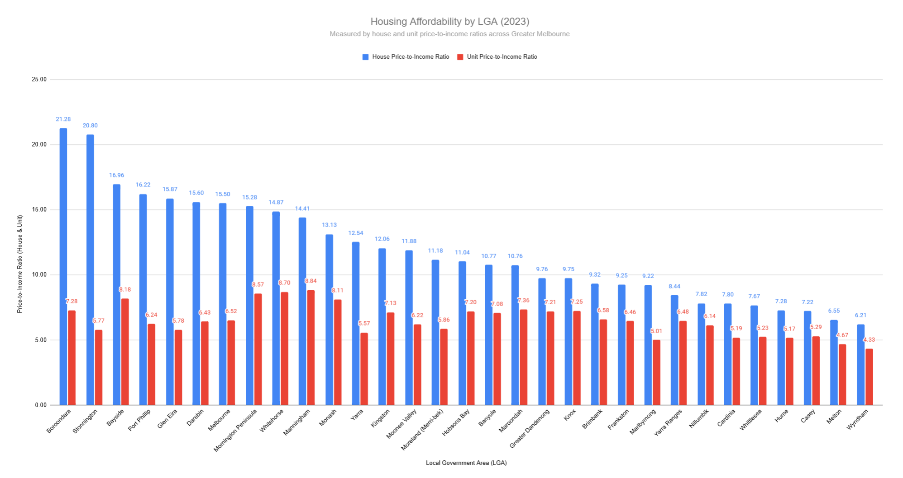
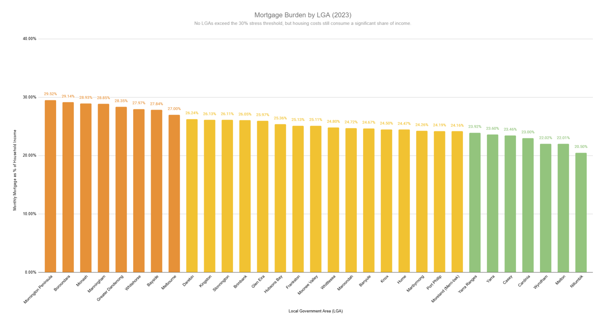
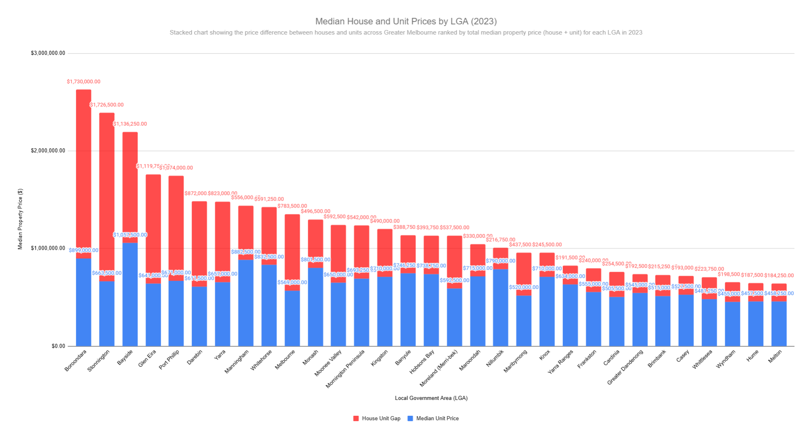
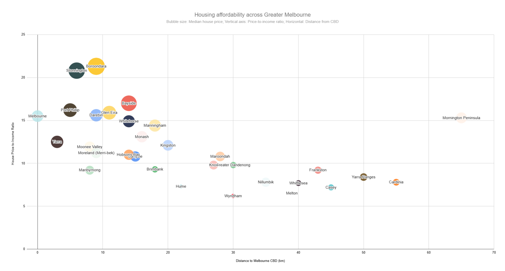

# Housing-Affordability-Victoria
Analyzing housing affordability across Greater Melbourne LGAs in 2023 using price-to-income ratios and demographic insights

# 🏠 Housing Affordability in Victoria (2023)

This project explores housing affordability across 31 Local Government Areas (LGAs) in Greater Melbourne. Using housing market data and 2021 Census income data, I evaluated where homes are affordable, where they're not — and how this relates to household income, distance to CBD, and demographic patterns.

---

## 📌 Objective

To assess housing affordability across Greater Melbourne’s 31 LGAs by analyzing key financial indicators.

This project examines:
- Median house and unit prices (2023)
- Median weekly household income (2021)
- House and unit price-to-income ratios
- Census-reported monthly mortgage repayments
- Mortgage stress levels (repayments as % of income)

The goal is to identify which regions are affordable — and which are financially out of reach — for the average household in Victoria.

---

## 📂 Data Sources

- **Vic Property Price 2023.xlsx**  
  Median house and unit prices by suburb for 2023, sourced from the [Victorian Property Sales Report – Median House by Suburb](https://discover.data.vic.gov.au/dataset/victorian-property-sales-report-median-house-by-suburb) (DataVic). Aggregated to LGA level for analysis.

- **lga_summary_2021.xlsx**  
  2021 Census data from the Australian Bureau of Statistics, including:
  - Median weekly household income
  - Median monthly mortgage repayments
  - Number of vehicles per household
  - Household size and family composition  
  Data structured by Local Government Area (LGA).

- **Suburb-to-LGA mapping (manual)**  
  Custom mapping created to align over 600 Melbourne suburbs with their respective LGAs. Verified using local government boundary maps and ABS definitions.

- **Distance to CBD**  
  Estimated driving distance from each LGA centroid to Flinders Street Station (Melbourne CBD) using Google Maps. Used to analyze the relationship between location and affordability.

---

## 🧮 Methodology

### 1. Data Preparation
- Mapped 600+ suburbs to their corresponding LGAs using a manually verified lookup.
- Aggregated 2023 median house and unit prices from suburb level to LGA level using data from the Victorian Government’s property sales reports.
- Merged this with 2021 ABS Census data (by LGA), including:
  - Median weekly household income
  - Median monthly mortgage repayments
  - Household size, vehicle ownership, and family data

### 2. Metric Calculations
- **Price-to-Income Ratios**:  
  Calculated separately for houses and units by dividing median property prices by annual household income (weekly income × 52).
- **Mortgage Burden**:  
  Used Census-reported monthly mortgage repayments as a percentage of income to assess financial stress across LGAs.
- **Distance to CBD**:  
  Used Google Maps to estimate driving distance from each LGA’s central suburb to Flinders Street Station (Melbourne CBD).

### 3. Visualization & Analysis
- Created visualizations in Google Sheets to explore affordability patterns:
  - Price-to-income ratio comparisons
  - Mortgage burden by LGA
  - Housing price gaps between houses and units
  - Affordability vs distance using bubble charts
- Identified regional patterns and developed LGA "personas" to humanize the data and highlight how affordability affects different demographics.

---

## 📊 Key Metrics Overview

Below is a snapshot of housing affordability across selected LGAs in Greater Melbourne.  
It highlights variation in income, house prices, and mortgage stress levels.

| LGA           | Median House Price | Weekly Income | Price-to-Income Ratio | Monthly Mortgage Repayment (ABS) | Mortgage Stress % |
|---------------|--------------------|----------------|------------------------|----------------------------------|--------------------|
| **Boroondara**  | $2,629,000           | $2,376          | 21.3                   | $3,000                           | 29.1%              |
| **Melton**      | $642,500             | $1,887          | 6.5                    | $1,800                           | 22.0%              |
| **Wyndham**     | $653,500             | $2,033          | 6.2                    | $1,930                           | 22.3%              |
| **Port Phillip**| $1,825,000           | $2,119          | 15.6                   | $3,000                           | 33.2%              |
| **Cardinia**    | $760,000             | $1,874          | 7.8                    | $1,868                           | 23.0%              |
| **Brimbank**    | $730,250             | $1,506          | 9.3                    | $1,700                           | 26.0%              |

> 💡 *Mortgage stress is commonly defined as spending more than 30% of household income on mortgage repayments.*

📄 **View all 31 LGAs in the full dataset**:  
[`final_LGA_affordability_summary_2023.xlsx`](data/final_LGA_affordability_summary_2023.xlsx)

---

## 🔍 Key Insights

### 🏙️ Inner Melbourne is financially inaccessible to most
- LGAs like **Boroondara**, **Stonnington**, and **Glen Eira** have **price-to-income ratios above 15**, with **Boroondara reaching 21.3**.
- Despite high incomes, mortgage stress in these areas still approaches the 30% threshold, reflecting extreme property values rather than low earnings.
- This trend is most visible in the dual bar chart and affordability bubble chart.

### 🚗 Outer LGAs offer relief — but with trade-offs
- Areas like **Melton**, **Wyndham**, and **Hume** show **price-to-income ratios under 7** and lower mortgage stress (~22%).
- However, they are located **25–45 km from the CBD**, with higher car ownership and larger household sizes.
- These regions rely heavily on private vehicles due to limited public transport access.

### 🧒 Families settle in southeast corridors — but face unit pressure
- **Cardinia**, **Casey**, and **Cranbourne-area LGAs** show higher numbers of children per family and larger household sizes.
- While detached housing remains somewhat affordable, **units in these areas are also becoming increasingly unaffordable**, with price-to-income ratios over 7.

### 💡 Affordability is not just a price issue — it's geographic and demographic
- Distance from the CBD, family size, transport infrastructure, and income levels all interact to shape affordability.
- The most affordable LGAs often involve trade-offs in commute time, lifestyle, and car dependence — a theme highlighted in the bubble and mortgage burden charts.

---

## 👥 LGA Persona Snapshots

These simplified LGA “personas” help illustrate how affordability affects real household types across different areas.

### **Boroondara – The Affluent Inner Elite**
> High income, low household size, extreme house price. Central professionals with low affordability despite wealth.

### **Casey – The Young Family Belt**
> Large families, multiple vehicles, growing population. Affordability better, but stress building in outer SE.

### **Melbourne – Singles and Students**
> Small households, renters dominate. Expensive housing, but fewer cars, smaller spaces.

---

## 📊 Visualizations

### 1. Housing Affordability by LGA (Price-to-Income Ratio)
  
📌 Shows how house and unit affordability varies across LGAs.  
Inner suburbs like Boroondara and Glen Eira exceed a ratio of 20, while outer LGAs like Melton remain below 7.

### 2. Mortgage Burden by LGA (2023)
  
💡 Highlights the percentage of income spent on mortgage repayments.  
Most LGAs remain just below the 30% stress threshold, with Port Phillip notably exceeding it at 33.2%.

### 3. Median House and Unit Prices by LGA
  
🏠 Compares housing types across LGAs.  
The gap between house and unit prices is especially large in Bayside and Boroondara, reinforcing exclusivity in inner zones.

### 4. Distance to CBD vs House Price-to-Income Ratio
  
🧭 Shows the trade-off between location and affordability.  
As distance from the CBD increases, affordability improves — but household reliance on cars and commute times also rise.

---

## 🗂️ File Structure

📁 **charts/**  
├── `chart_links.md` — Chart image references (optional/internal)

📁 **data/**  
├── `Vic Property Price 2023.xlsx` — Raw property price data by suburb  
└── `lga_summary_2021.xlsx` — ABS 2021 Census data (income, mortgage, etc.)

📁 **output/**  
├── `01_distance_vs_price_ratio.png` — Bubble chart: Distance to CBD vs affordability  
├── `02_house_unit_gap.png` — Stacked bar: House vs unit prices  
├── `03_mortgage_burden_by_lga.png` — Bar chart: Mortgage stress % by LGA  
├── `04_price_income_ratio_by_lga.png` — Dual bar: House & unit price-to-income ratios  
└── `final LGA affordability summary (2023).xlsx` — Final merged dataset used for analysis

📄 `README.md` — Project overview, insights, and visualizations

---

## ✅ Conclusion

This project reveals stark contrasts in housing affordability across Greater Melbourne.  
While inner suburbs like Boroondara and Stonnington remain financially inaccessible to most households, outer LGAs such as Melton and Wyndham offer relative affordability — but often at the cost of longer commutes and car dependence.

Census data shows that mortgage stress is not confined to low-income areas; even high-income LGAs approach the 30% threshold due to property prices vastly outpacing income growth.

Affordability, therefore, is not just about price — it's shaped by geography, infrastructure, and demographic realities.  
This analysis highlights the importance of considering both financial and lifestyle trade-offs when assessing livability and equity in urban development.

---

## 💼 About Me

I'm an aspiring data analyst based in Melbourne, passionate about applying data to real-world problems. This project was built using Excel, Google Sheets, Python (Colab), and GitHub to demonstrate my skills in:

- Data wrangling and cleaning
- Geospatial and demographic analysis
- Insight communication
- Visual storytelling

